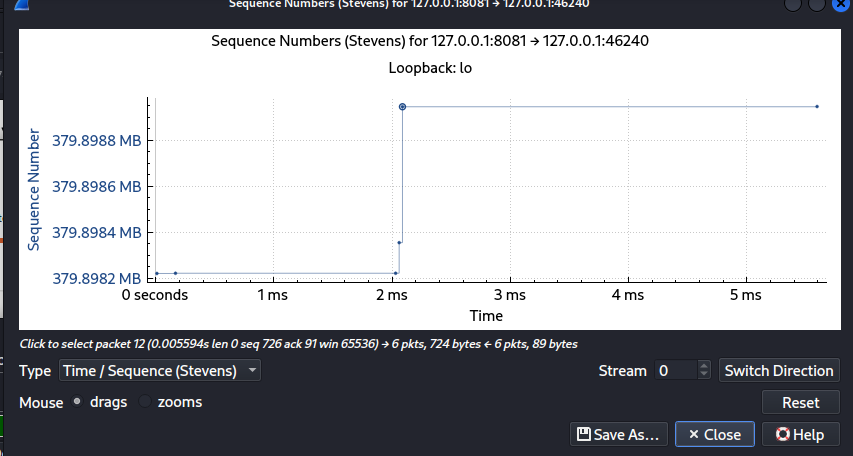

# 第5天：TCP Stream Graph 分析

## 学习目标
- 掌握 Wireshark 的 TCP Stream Graph 功能。

## 操作步骤
1. 运行 `sqli_server.py`。
2. 使用 Burp Repeater 发送 SQL 注入 Payload (`1' OR '1'='1`)。
3. 用 Wireshark 抓取 `tcp.port == 8081` 的流量。
4. 选中 HTTP 包，生成 `Time-Sequence (Stevens)` 图表。

## 截图
- 

## 总结
- 成功看到 TCP 请求与响应的时间序列图，直观理解了数据包的传输过程。