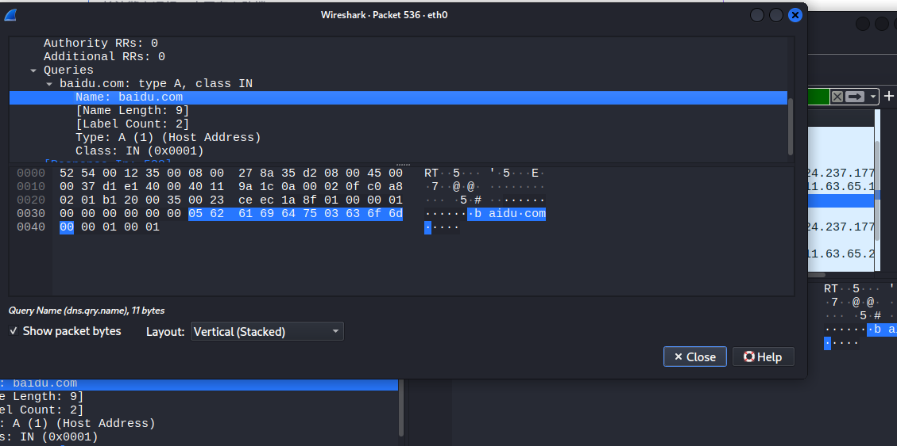
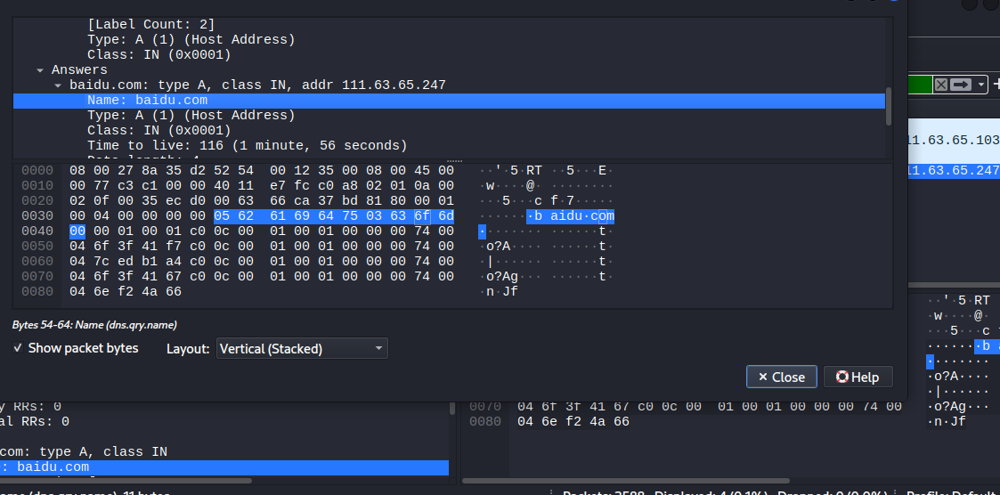

# 第6天：DNS 抓包分析

## 学习目标
- 理解 DNS 协议的基本工作原理（请求与响应）。
- 掌握使用 Wireshark 过滤和分析 DNS 流量。

## 操作步骤
1. 打开 Wireshark，选择网卡 `eth0` 开始抓包。
2. 在 Firefox 浏览器中访问 `http://baidu.com`。
3. 停止抓包，应用过滤器 `dns.qry.name == "baidu.com"`。
4. 定位 DNS 请求包（`Standard query A baidu.com`）。
5. 在详情窗口中，找到 `[Response In: 540]`，定位对应的响应包。
6. 分别截图请求包的 `Queries` 部分和响应包的 `Answers` 部分。

## 截图
- 
  *(截图说明：请求包中 `Queries` 部分显示 `Name: baidu.com`, `Type: A`)*
- 
  *(截图说明：响应包中 `Answers` 部分显示 `Name: baidu.com`, `Type: A`, `Address: 111.63.65.1`)*

## 总结
- 成功捕获了 `baidu.com` 的 DNS 解析过程。
- 理解了 DNS 请求与响应的对应关系（通过 `Transaction ID` 或 `Response In` 字段）。
- 为后续分析更复杂的网络故障（如 DNS 劫持、解析失败）打下基础。